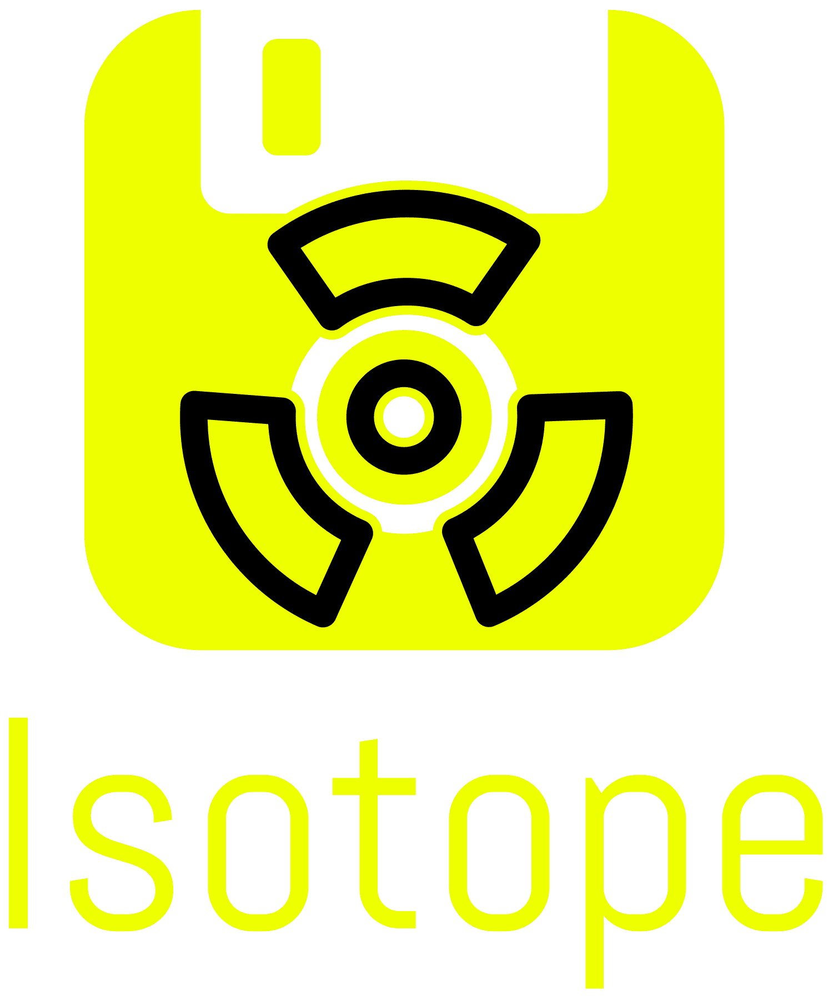

# Isotope Language Support for VS Code



A comprehensive Visual Studio Code extension providing full language support for Isotope specifications with IntelliSense, validation, syntax highlighting, and integrated build tools.

## ✨ Features

### **🎨 Rich Language Support**
- **Syntax Highlighting**: Custom TextMate grammar with semantic highlighting
- **IntelliSense**: Context-aware auto-completion for all Isotope keywords
- **Stage-Aware Completions**: Smart suggestions based on current build stage
- **Hover Documentation**: Instant help for keywords and instructions

### **🔍 Real-Time Validation**
- **Live Error Detection**: Real-time validation using the Isotope CLI
- **Diagnostic Integration**: Errors and warnings displayed inline
- **Save-Time Validation**: Automatic validation when saving files
- **Problem Panel Integration**: All issues shown in VS Code's Problems panel

### **🚀 Integrated Build Tools**
- **One-Click Building**: Build ISOs directly from VS Code
- **Progress Tracking**: Real-time build progress with cancellation support
- **Build History**: Track and review previous builds
- **Output Management**: Automatic output directory handling

### **📁 Dedicated Sidebar**
- **Specification Explorer**: Browse all Isotope files in workspace
- **Build History**: View recent builds with success/failure status
- **Template Gallery**: Quick-start templates for common configurations
- **Context Actions**: Right-click build, validate, and test operations

### **🛠️ Advanced Features**
- **JSON Conversion**: Convert legacy JSON configurations to Isotope format
- **Template System**: Built-in templates for Ubuntu, Windows, and custom builds
- **Multi-Workspace Support**: Works across multiple workspace folders
- **Command Palette Integration**: All features accessible via Ctrl/Cmd+Shift+P

## 🔧 Installation

### From VS Code Marketplace
1. Open VS Code
2. Go to Extensions (`Ctrl+Shift+X`)
3. Search for "Isotope Language Support"
4. Click Install

### From VSIX
1. Download the latest `.vsix` from [releases](https://github.com/OmniCloudOrg/vscode-isotope/releases)
2. Run: `code --install-extension isotope-lang-1.0.0.vsix`

## ⚙️ Configuration

Configure the extension via VS Code settings:

```json
{
  "isotope.executable.path": "isotope",
  "isotope.validation.enabled": true,
  "isotope.validation.onSave": true,
  "isotope.autoCompletion.enabled": true,
  "isotope.build.outputDirectory": "./output",
  "isotope.build.showProgress": true,
  "isotope.logging.level": "info"
}
```

### Settings Reference

| Setting | Type | Default | Description |
|---------|------|---------|-------------|
| `isotope.executable.path` | string | `"isotope"` | Path to Isotope CLI executable |
| `isotope.validation.enabled` | boolean | `true` | Enable real-time validation |
| `isotope.validation.onSave` | boolean | `true` | Validate on file save |
| `isotope.autoCompletion.enabled` | boolean | `true` | Enable IntelliSense |
| `isotope.build.outputDirectory` | string | `"./output"` | Default output directory |
| `isotope.build.showProgress` | boolean | `true` | Show build progress |
| `isotope.logging.level` | string | `"info"` | Logging verbosity |

## 🚀 Getting Started

### 1. Create Your First Specification

Use `Ctrl+Shift+P` → "Isotope: New Isotope Specification" to create from templates:

```dockerfile
# Ubuntu Server with Docker
FROM ./ubuntu-22.04-server.iso
CHECKSUM sha256:a4acfda10b18da50e2ec50ccaf860d7f20ce1ee42895e3840b57b2b371fc734

LABEL name="ubuntu-docker"
LABEL version="1.0.0"

STAGE init
VM provider=qemu
VM memory=4G
VM cpus=2

STAGE os_install
WAIT 30s
PRESS enter
# ... installation automation

STAGE os_configure  
RUN apt-get update
RUN apt-get install -y docker.io
COPY ./configs/setup.sh /usr/local/bin/

STAGE pack
EXPORT ./output/ubuntu-docker.iso
BOOTABLE true
```

### 2. Use IntelliSense

- Type `STAGE` → auto-complete with stage options
- Type `VM` → get property suggestions (provider, memory, cpus, etc.)
- Type `PRESS` → get key name completions (enter, tab, esc, etc.)
- Hover over keywords for instant documentation

### 3. Build Your ISO

- **Command Palette**: `Ctrl+Shift+P` → "Isotope: Build ISO"  
- **Context Menu**: Right-click .isotope file → "Build ISO"
- **Sidebar**: Click build button (🚀) next to specification
- **Keyboard**: `F5` when editing .isotope file

### 4. Monitor Progress

Watch real-time build progress in:
- Notification popup with progress bar
- Build History sidebar panel
- Terminal output (if enabled)

## 📚 Language Features

### **Stage-Aware Completions**

The extension provides intelligent completions based on your current stage:

| Stage | Available Instructions |
|-------|----------------------|
| `init` | `VM` (provider, memory, cpus, disk, etc.) |
| `os_install` | `WAIT`, `PRESS`, `TYPE` |
| `os_configure` | `RUN`, `COPY`, `WAIT`, `PRESS`, `TYPE` |
| `pack` | `EXPORT`, `FORMAT`, `BOOTABLE`, `VOLUME_LABEL` |

### **Smart Validation**

Real-time validation catches errors as you type:

- ✅ **Syntax Validation**: Proper keyword usage and formatting
- ✅ **Semantic Validation**: Stage-appropriate instructions  
- ✅ **Value Validation**: Valid providers, formats, durations
- ✅ **File Validation**: Source file existence and checksums

### **Rich Hover Information**

Hover over any keyword for comprehensive documentation:

```
WAIT - Waits for a duration or condition

Examples:
• WAIT 30s
• WAIT 5m FOR "Installation complete!"

Supported units: s (seconds), m (minutes), h (hours)
```

## 🎨 Syntax Highlighting

Custom theme with semantic highlighting for:

- **Keywords**: `FROM`, `STAGE`, `RUN`, etc. (bold blue)
- **Stage Names**: `init`, `os_install`, etc. (teal)
- **Properties**: `provider`, `memory`, etc. (light blue)  
- **Values**: strings, numbers, booleans (various colors)
- **Comments**: `#` prefixed lines (green, italic)
- **Templates**: `${VAR}` variables (orange)

## 🗂️ Sidebar Integration

The Isotope sidebar provides three panels:

### **📋 Specifications**
- Browse all `.isotope` files in workspace
- Click to open files
- Right-click for build/validate/test actions
- File modification indicators

### **📊 Build History** 
- Recent build results with timestamps
- Success/failure status indicators
- Build duration and error details
- Click to view detailed logs

### **📄 Templates**
- Pre-built specification templates
- Ubuntu Server, Windows 11, minimal Linux
- One-click template insertion
- Custom template support

## ⌨️ Keyboard Shortcuts

| Shortcut | Command |
|----------|---------|
| `F5` | Build current specification |
| `Shift+F5` | Validate current specification |
| `Ctrl+F5` | Test VM boot |
| `Ctrl+Shift+N` | New specification from template |

*Note: Shortcuts only active when editing .isotope files*

## 🔧 Commands

All commands available via Command Palette (`Ctrl+Shift+P`):

- `Isotope: Build ISO` - Build current specification
- `Isotope: Validate Specification` - Validate syntax and semantics  
- `Isotope: Test VM Boot` - Test VM boot without full build
- `Isotope: Convert JSON to Isotope` - Convert legacy configurations
- `Isotope: New Isotope Specification` - Create from templates
- `Isotope: Open Output Directory` - Open build output folder
- `Isotope: Refresh Specifications` - Refresh sidebar views

## 📋 Requirements

- **VS Code**: Version 1.74.0 or higher
- **Isotope CLI**: Installed and accessible in PATH
- **System Requirements**: Based on chosen VM provider (QEMU, VirtualBox, etc.)

### Installing Isotope CLI

```bash
# Install via cargo
cargo install isotope

# Or build from source  
git clone https://github.com/OmniCloudOrg/isotope.git
cd isotope
cargo build --release
```

## 🐛 Troubleshooting

### **Validation Not Working**
1. Ensure Isotope CLI is installed: `isotope --version`
2. Check executable path in settings
3. Verify workspace has .isotope files
4. Check Problems panel for specific errors

### **Build Fails**
1. Validate specification first
2. Check output directory permissions  
3. Ensure source ISO files exist
4. Review build logs in Build History

### **IntelliSense Not Working**
1. Ensure file has `.isotope` extension
2. Check `isotope.autoCompletion.enabled` setting
3. Reload VS Code window
4. Check for conflicting extensions

### **Sidebar Not Showing**
1. Ensure workspace contains `.isotope` files
2. Click Isotope icon in Activity Bar
3. Run "Isotope: Refresh Specifications"
4. Check View → Open View... → Isotope

## 🤝 Contributing

We welcome contributions! Please see our [Contributing Guide](CONTRIBUTING.md).

### Development Setup

```bash
# Clone the repository
git clone https://github.com/OmniCloudOrg/vscode-isotope.git
cd vscode-isotope

# Install dependencies
npm install

# Compile TypeScript
npm run compile

# Package extension
vsce package
```

### Testing

```bash
# Run tests
npm test

# Open extension development host
F5 in VS Code
```

## 📄 License

MIT License - see [LICENSE](LICENSE) file for details.

## 🔗 Links

- [Isotope CLI](https://github.com/OmniCloudOrg/isotope) - Main Isotope project
- [Documentation](https://docs.omnicloud.com/isotope) - Complete documentation
- [Issues](https://github.com/OmniCloudOrg/vscode-isotope/issues) - Bug reports and feature requests
- [Marketplace](https://marketplace.visualstudio.com/items?itemName=omnicloud.isotope-lang) - VS Code Marketplace

---

<div align="center">
<sub>Built with ❤️ by the OmniCloud Community</sub>
</div>